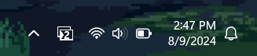

# komotray

Simple and lightweight tray icon that shows the current workspace for the [Komorebi window manager](https://github.com/LGUG2Z/komorebi/).

This is a Rust rewrite of the [original AutoHotKey komotray](https://github.com/urob/komotray) with improvements in automatically recovering from error states and using a single-threaded asynchronous runtime to optimize resource usage. Icons are courtesy of the original, provided by urob.

A major limitation is that only two monitors are supported due to the lack of icons. If you use more than two monitors, try using a status bar like yasb or Zebar. Or if you are a graphics designer, you can make yourself new icons and place them in `./assets/icons/` with the naming scheme `workspace-monitor.ico`. Feel free to contribute those icons to help others out too by creating an issue or pull request!

Licensed under MIT.